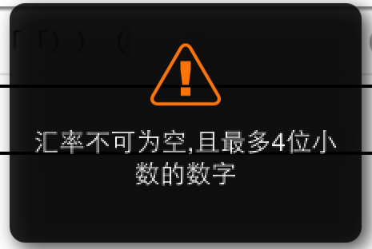

iOS-Toast
=========

This UIView category can be used to display a message  

This is come from other repository. I just store here for reference.
The Toast just use for present a hint message for iOS App.

Usage:  
    Add frameworks: QuartzCore.framework, CoreGraphics.framework

